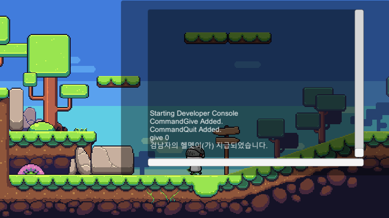
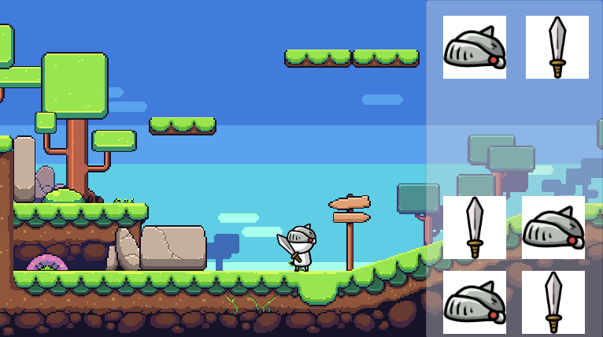

# RPG

이 프로젝트는 2019.3.6f1버전으로 만들어졌습니다. 
RPG게임을 공부하기 위한 목적으로 만들어졌으며 저는 어떠한 권한도 가지지 않습니다. 
많은 학생들이 이 프로젝트를 통해 배우는것이 많아졌으면 좋겠습니다. 

## 에셋 Assets
Free - 2D Simple Character : Swordman 
Free - Nature pixel art base assets FREE 

# Developer Console
  
개발자 콘솔을 통해 게임을 조작할 수 있습니다. 
커맨드는 모두 Lua Script로 제작되었습니다. 
아이템 지급과 플레이어의 속도 등 개발자가 테스트할 수 있는 모든 부분을 조작이 가능하게 할 수 있습니다. 
명령어는 모두 소문자로 시작합니다. 

## 명령어 Command
quit 
give [ItemCode] 

# 인벤토리 Inventory
   
인벤토리는 Json으로 데이터를 공유합니다. 

## 장비칸 Equipments Slot
인벤토리의 처음 두번째슬롯은 장비슬롯입니다. 
첫번째슬롯은 머리, 두번째슬롯은 무기 슬롯입니다. 

## 아이템칸 Item Slot
나머지 슬롯은 아이템 슬롯입니다. 
장비슬롯에 들어가지 못한 장비나 아이템을 저장합니다. 

