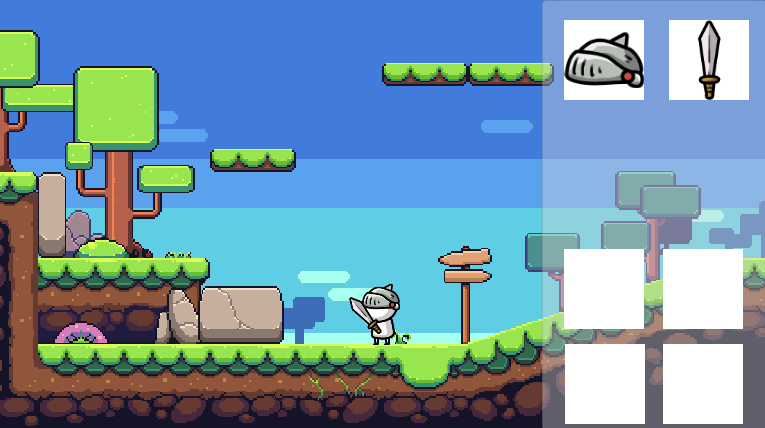

# RPG-Basic

이 프로젝트는 2019.3.6f1버전으로 만들어졌습니다. 
RPG게임의 템플릿을 공부하기 위한 목적으로 만들어졌으며 저는 어떠한 권한도 가지지 않습니다. 
많은 학생들이 이 프로젝트를 통해 배우는것이 많아졌으면 좋겠습니다. 

This project was created in version 2019.3.6f1. 
It is designed to study the template of RPG games and I have no authority. 
I hope many students learn more from this project.

# Developer Console
  
개발자 콘솔을 통해 게임을 조작할 수 있습니다. 
아이템 지급과 플레이어의 속도 등 개발자가 테스트할 수 있는 모든 부분을 조작이 가능하게 할 수 있습니다. 
명령어는 모두 소문자로 시작합니다. 

You can manipulate the game through the developer console. 
All parts that can be tested by developers, such as item payment and player speed, can be manipulated. 
The command starts with all lowercase letters. 

## 명령어 Command
quit 
give [ItemCode] 

# 인벤토리 Inventory
## 장비창 Equipments
  
인벤토리의 처음 두번째슬롯은 장비슬롯입니다. 
첫번째슬롯은 머리, 두번째슬롯은 무기 슬롯입니다. 

The first second slot in the inventory is the equipment slot. 
The first is the head, the second is the weapons slot. 
